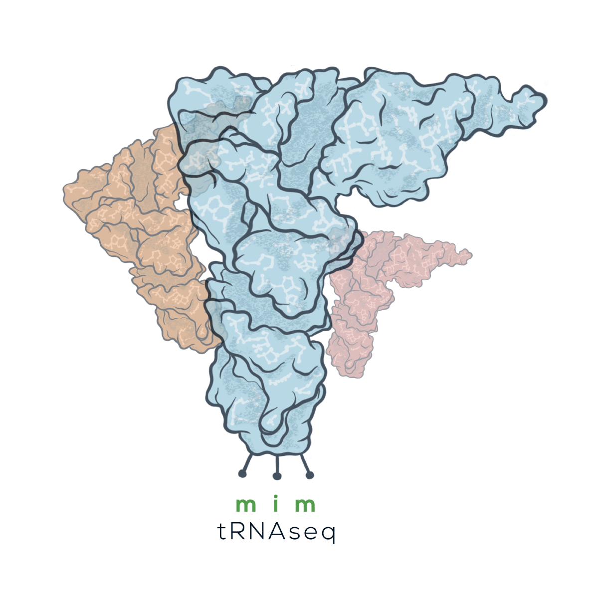

<p align="center">
	
</p>

# mim-tRNAseq
[](https://mim-trnaseq.readthedocs.io/en/latest/?badge=latest)
[](https://www.gnu.org/licenses/gpl-3.0)
### Modification-induced misincorporation tRNA sequencing.

This package is an automated analysis pipeline for the quantification and analysis of tRNA expression and modification. Given trimmed sequencing reads in fastq format, this pipeline will:
* Cluster tRNAs, index modifications, and perform SNP-tolerant read alignment with [GSNAP](http://research-pub.gene.com/gmap/)
* Calculate coverage information and plots (useful for QC)
* Quantify expression
* Calculate tRNA differential expression with [DESeq2](https://bioconductor.org/packages/release/bioc/html/DESeq2.html).
* Analyze functional tRNA pools and tRNA completeness via 3'-CCA analysis
* Comprehensive modification quantification and misincorporation signature analysis

## Method strategy

Detailed methodology is shown in the image below, and described in Behrens et al. (2020)


 
## Installation and usage

[](https://mim-trnaseq.readthedocs.io/en/latest/?badge=latest)

Please see the full documentation for explanations of dependencies, inputs formatting, and outputs.

To use mim-tRNAseq, it is recommended to install the package using `conda`, preferably in its own environment:
```bash
	conda create -n mimseq
	conda actiavte mimseq
	conda install -c drewjbeh mimseq
```
Additional packageges are required that cannot be installed by `conda` before mim-tRNAseq can be run.
To install ggpol, please do the following:
```bash
	Rscript -e 'devtools::install_version("ggpol", version = "0.0.5", repos="http://cran.us.r-project.org", upgrade = FALSE)'
```
usearch needs to be acquired and installed. Please do the following:
```bash
	wget https://drive5.com/downloads/usearch10.0.240_i86linux32.gz
	gunzip usearch10.0.240_i86linux32.gz
	mv usearch10.0.240_i86linux32 usearch
	cp usearch /usr/local/bin
```
For this, root access is required. However, if this is not possible, please add the path to the usearch binary to your PATH:
```bash
export PATH=$PATH:full/path/to/usearch
```

Alternatively, mim-tRNAseq can be installed with `pip`, in which case all additional non-python package dependencies (see documentation) will also need to be installed.
```bash
	pip install mimseq
```

Once installed, mim-tRNAseq should be executable and help displayed, by running
```bash
	mimseq --help
```
An example command to run mim-tRNAseq may look as follows. This will run an analysis between HEK293T and K562 cells on an example dataset included in the package:
```bash
	mimseq --species Hsap --cluster --cluster-id 0.95 --snp-tolerance --cca-analysis --threads 15 --min-cov 2000 --max-mismatches 0.1 --control-condition HEK293T -n hg19_test --out-dir hg19_HEK239vsK562 --max-multi 4 --remap --remap-mismatches 0.075 sampleData_HEKvsK562.txt
```
The run should take around 15 minutes on a server using 15 processors (`--threads 15`: please update according to your server capabilities).

## Contact

Drew Behrens: abehrens@biochem.mpg.de

Danny Nedialkova: nedialkova@biochem.mpg.de

Nedialkova laboratory: https://www.biochem.mpg.de/nedialkova


## Cite

Behrens et al., High-resolution quantitative profiling of tRNA pools by mim-tRNAseq (2020)

