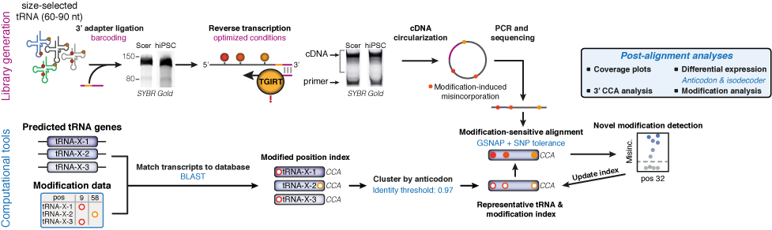
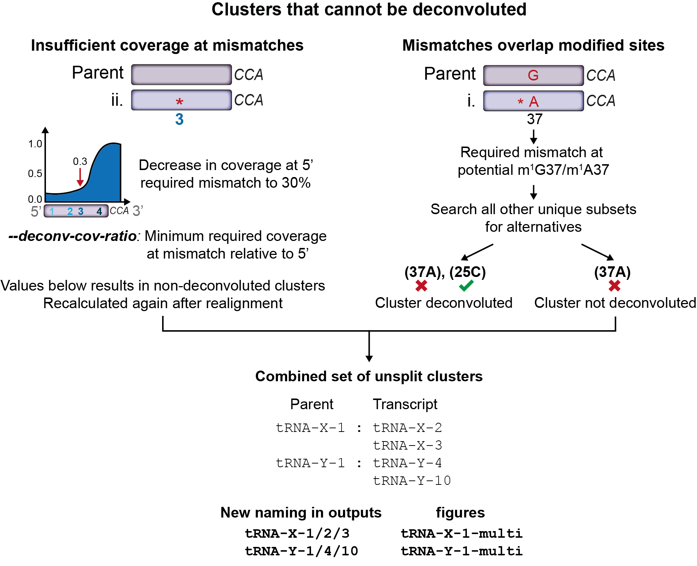
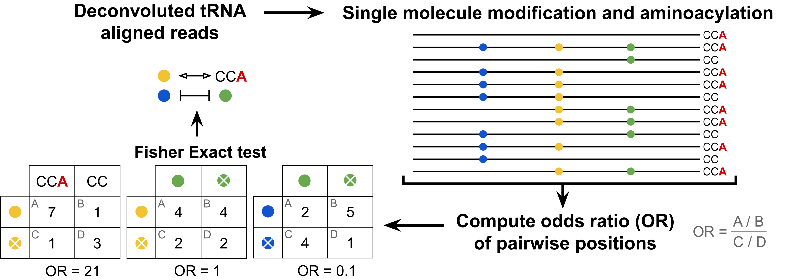

mim-tRNAseq introduction
========================

Method strategy
^^^^^^^^^^^^^^^

The driving force behind this pipeline is the unique alignment strategy it uses to accurately place tRNA-seq reads during alignment. The method is based on the ability of a thermostable group II intron reverse transcriptase (TGIRT) to misincorportate nucleotides at some modified tRNA positions. 

Due to the abundance of modifications to tRNA residues, as well as high sequence similarity between tRNA genes and isodecoders, the generation and alignment of tRNA sequencing datasets is faced with two problems: 1) popular RTs often cannot readthrough Watson-Crick face modifications during the cDNA synthesis step of RNA-seq library preparation, resulting in hard stops to RT, and 2) even when full-length reads are sequenced, they cannot be uniquely placed during alignment because of the high degree of sequence similarity between tRNAs. This results in high rates of multi-mapping reads which are difficult to use for downstream analysis.

Using mim-tRNAseq and TGIRT overcomes these problems. First, tRNA genes sharing anticodons are clustered according to a user-defined ID threshold to limit read placement ambiguity during alignment. Next, misincorporation by TGIRT at modified nucleotides allows read-through of modifications producing longer reads and libraries with less biased tRNA coverage, further improving alignment statistics and quantification. Additionally, indexed modification data is used in SNP-tolerant alignments by GSNAP (Wu and Nacu, 2010) to account for misincorporations, and thereby guide more accurate read placement. Finally, :ref:`Deconvolution` of cluster-aligned reads to transcripts restores resolution. Collectively, mim-tRNAseq improves tRNA gene coverage from sequencing data and thereby reduces bias, enables more data from libraries to be used by reducing multi-mapping, and overall improves estimation of tRNA expression and modification abundance.

Further automated downstream analyses included in the pipeline allow a "one command" analysis of differential expression, detailed modification analysis and pairwise comparisons of their abundance between conditions, 3'-CCA completeness and coverage.

Detailed methodology is shown in the image below, and described in `Behrens <https://doi.org/10.1016/j.molcel.2021.01.028>`_ et al., 2021, Molecular Cell 81, 1–14

Deconvolution
^^^^^^^^^^^^^

Since v0.3, the deconvolution algorithm has been updated to consider all mismatches as a set for each unique isodecoder (see image above). This theoretically allows the distinction and deconvolution of all unique tRNA sequences, since by definition each unique sequence has a distinct set of mismatches. 

Despite this, there are 3 reasons why some clusters, or particular transcripts in a cluster, cannot be deconvoluted. See the image below for an overview of the handling of clusters that cannot be deconvoluted.

Firstly, some clusters still have 3' coverage bias due to modifications that induce stops to RT. In these cases, complete deconvolution of reads for these sequences might not be possible if coverage at a mismatch defining that tRNA is significantly lower than at the 3' end of the tRNA (in this case, the number of reads assigned to this sequence will be underestimated). In order to overcome this, the *--deconv-cov-ratio* parameter can be used to set a threshold for this difference in coverage. Sequences not passing this threshold will be marked as not deconvoluted. 

Secondly, some tRNAs may only be distinguishable from the parent cluster by positions that might also be modified sites. In these cases, it becomes impossible to tell if a mismatch in a read is due to mismatches between cluster members, or if it is due to misincorporations at the modification. Such tRNA transcripts (and the parent of the cluster) are also labelled as not deconvoluted.

Lastly, reads that cannot be assigned to a transcript within a cluster are assumed to originate from the parent and are, by default, left assigned to the parent sequence. However, in some cases these parent-assigned reads also contain erroneous mismatches which indicate that they might not indeed to the parent transcript either. In our experience, these mismatches can arise from GSNAP incorrectly aligning reads containing indels (which sometimes seem to be induced by nearby modified sites), or some degree of misalignment of reads to an incorrect cluster. If 10% or more parent-assigned reads contain such mismatches, the entire cluster is not deconvoluted as these reads are likely to significantly impact the correct estimation of parent abundance, and can also impact the deconvolution choice made my mim-tRNAseq for other members of the cluster. 

Transcripts that are not deconvoluted are renamed to provide details on which transcripts remain clustered. These are then treated as other single transcripts for differential expression analysis, modification profiling, and other downstream analyses. For example, if Ala-AGC-1 and Ala-AGC-2 are clustered and cannot be deconvoluted, these two transcripts will remain clustered, be renamed to Ala-AGC1/2 (the parent isodecoder number for the cluster is always listed first), and appear as a single entry for counts, modification analysis, differential expression, and coverage data. For the purpose of readability in plots, the naming of unsplit clusters is shown as Ala-AGC-1-multi. This is particularly useful for clusters with many unsplit sequences as these have unnecessarily long labels for display purposes.

SingLe-read Analysis of Crosstalks
^^^^^^^^^^^^^^^^^^^^^^^^^^^^^^^^^^

Since v1.2.1, the SingLe-read Analysis of Crosstalks (SLAC; `Hernandez-Alias <https://doi.org/10.1093/nar/gkac1185>`_ et al., 2022, Nucleic Acids Research, gkac1185) has been incorporated in the mim-tRNA-seq software, which allows the detection of transcriptome-wide crosstalks between pairs of tRNA modifications and modification-aminoacylation.

Because of its size, tRNA-seq produces reads that can cover the entire length of the tRNA; tRNA-seq also captures certain tRNA modifications as ‘misincorporations’ relative to the reference tRNA sequence, and the charging status by the 3'-CCA ends depending on the library construction protocol. SLAC considers all pairwise combinations modification-modification and modification-charging. For each pair, it determines the number of reads for: (i) both sites are modified/charged, (ii) site 1 is, site 2 is not modified/charged, (iii) site 1 is not, site 2 is modified/charged and (iv) both sites are not modified/charged. The analysis produces an odds ratio (OR) that informs whether the pair of modification-modification or modification-charging tend to appear together in the same read (OR > 1, stimulatory crosstalk) or tend to be exclusive of one another (OR < 1, inhibitory crosstalk), as well as calculates the significance of this interdependence using Fisher's exact test.

